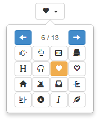

# [Bootstrap-Iconpicker v1.5.0](http://victor-valencia.github.io/bootstrap-iconpicker)


A simple iconpicker for Bootstrap 3.

Please note that this project is for <a href="http://getbootstrap.com/"><strong>Bootstrap 3.2</strong></a>, including Glyphicons or <a href="http://fontawesome.io/"><strong>Font Awesome Icons</strong></a> .

## Table of contents
- [Quick start](#quick-start)
- [Documentation and live examples](#documentation-and-live-examples)
- [Changelog](#changelog)
- [Versioning](#versioning)
- [Author](#author)
- [Contributors](#contributors)
- [License](#license)

## Quick start

Three quick start options are available:

- [Download the latest release](https://github.com/victor-valencia/bootstrap-iconpicker/archive/v1.5.0.zip).
- Clone the repo: `git clone https://github.com/victor-valencia/bootstrap-iconpicker.git`.
- Install with [Bower](http://bower.io): `bower install bootstrap-iconpicker`.

### What's included
Within the download you'll find the following directories and files, logically grouping common assets and providing both compiled and minified variations. You'll see something like this:

```
bootstrap-iconpicker/
├── css/
│   ├── bootstrap-iconpicker.css
│   ├── bootstrap-iconpicker.min.css
├── js/
│   ├── font-awesome/
│       ├── fa-icon-names-4.0.0.js
│       ├── fa-icon-names-4.0.0.min.js
│       ├── fa-icon-names-4.1.0.js
│       ├── fa-icon-names-4.1.0.min.js
│       ├── fa-icon-names-4.2.0.js
│       ├── fa-icon-names-4.2.0.min.js
│   ├── bootstrap-iconpicker.js
│   └── bootstrap-iconpicker.min.js
```

We provide compiled CSS and JS (`bootstrap-iconpicker.*`), as well as compiled and minified CSS and JS (`bootstrap-iconpicker.min.*`).

## Documentation and live examples
See documentation and live examples here: <a href="http://victor-valencia.github.io/bootstrap-iconpicker">http://victor-valencia.github.io/bootstrap-iconpicker</a>

## Changelog
- v1.0.0 - Version initial. @[victor-valencia](https://github.com/victor-valencia)
- v1.0.1 - Reducing the size of the source file. @[victor-valencia](https://github.com/victor-valencia)
- v1.1.0 - Dispatch 'change' event when an iconpicker is changed. @[promatik](https://github.com/promatik)
- v1.2.0 - Add the method 'setIcon'. @[victor-valencia](https://github.com/victor-valencia)
- v1.2.1 - Add '.iconpicker-popover' class. @[jwhitfieldseed](https://github.com/jwhitfieldseed)
- v1.3.0 - Support multiple versions of FontAwesome. @[victor-valencia](https://github.com/victor-valencia)
- v1.3.1 - Bind body 'click' to solve issues for ajax loaded pages. @[crlcu](https://github.com/crlcu)
- v1.4.0 - Support for customization of the component. @[victor-valencia](https://github.com/victor-valencia)
- v1.5.0 - Add search field. @[victor-valencia](https://github.com/victor-valencia)

## Versioning
For transparency into our release cycle and in striving to maintain backward compatibility, Bootstrap is maintained under [the Semantic Versioning guidelines](http://semver.org/). Sometimes we screw up, but we'll adhere to those rules whenever possible.

## Author
@[victor-valencia](https://github.com/victor-valencia)

## Contributors
@[victor-valencia](https://github.com/victor-valencia), @[promatik](https://github.com/promatik), @[jwhitfieldseed](https://github.com/jwhitfieldseed), @[crlcu](https://github.com/crlcu)

## License
Licensed under [the MIT license](LICENSE).