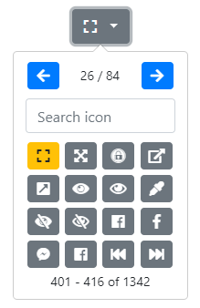

# [Bootstrap-Iconpicker v1.10.0](http://victor-valencia.github.io/bootstrap-iconpicker)

A simple iconpicker for Bootstrap 3.x and 4.x.

## Table of contents
- [What's next](#whats-next)
- [Changelog](#changelog)

## What´s next
- [ ] Support for multiple versions (v1.3.x) of [Weather Icons](http://erikflowers.github.io/weather-icons/).
- [ ] Support for versions (v5.2.x, v5.1.x, and v5.0.x) of [Font Awesome Icons](http://fontawesome.io/).
- [ ] Support for versions (v8.x, v7.x, v6.x, and v5.x) of [Octicons](https://octicons.github.com/).
- [ ] Support for versions (v4.4.1, and v3.x) of [Ionicons](http://ionicons.com/).
- [ ] Support for versions (v3.2.0) of [Flag Icons](http://flag-icon-css.lip.is/).

## Changelog
- . (2018-Oct-10)    
    - Support for [Bootstrap 4.x](http://getbootstrap.com/).
    - Support for multiple versions of [Font Awesome Icons (Free and Pro)](http://fontawesome.io/). (v5.3.1, v5.3.1_pro)
    - Support for [Weather Icons](http://erikflowers.github.io/weather-icons/). (v2.0.10)    
    - Change default options:            
        - `arrowNextIconClass` = `fas fa-arrow-right` (Previous value: `glyphicon glyphicon-arrow-right`)
        - `arrowPrevIconClass` = `fas fa-arrow-left` (Previous value: `glyphicon glyphicon-arrow-left`)
        - `iconset` = `fontawesome5` (Previous value: `glyphicon`)
        - `unselectedClass` = `btn-secondary`. (Previous value: `btn-default`)
    - Add file `bootstrap-iconpicker.bundle.min.js`, this file includes `bootstrap-iconpicker-iconset-all.min.js` and `bootstrap-iconpicker.min.js` files.

- . (2017-Jul-27)
    - Includes all iconset files in file `bootstrap-iconpicker-iconset-all.js`.
    - Add option `iconsetVersion`.
    - Support for [Flag Icons](http://flag-icon-css.lip.is/). (v2.8.0)
    - Support for multiple versions of [Typicons](http://typicons.com). (v2.0.9, v2.0.8, v2.0.7, v2.0.5, v2.0.4, v2.0.3, v2.0.2, v2.0.1)
    - Support for multiple versions of [Octicons](https://octicons.github.com/). (v4.4.0, v4.3.0, v4.2.1, v4.2.0, v4.1.1, v4.1.0, v4.0.0, v3.5.0, v3.4.1, v3.4.0, v3.3.0, v3.2.0, v3.1.0, v3.0.0, v2.4.1, v2.4.0, v2.3.0, v2.2.2, v2.2.1, v2.2.0, v2.1.2, v2.1.1, v2.1.0, v2.0.2, v2.0.1, v2.0.0)
    - Support for multiple versions of [Material Design Icons](http://zavoloklom.github.io/material-design-iconic-font/). (v2.2.0, v2.1.2, v2.1.1, v2.1.0, v2.0.2, v2.0.1, v2.0.0)
    - Support for [Ionicons](http://ionicons.com/). (v2.0.1 @[ibrahimyilmaz7](https://github.com/ibrahimyilmaz7))
- . (2017-Jul-19)
    - Fix navigation to invalid pages.
    - Filling search/hidden inputs. @[s-belichenko-sold](https://github.com/s-belichenko-sold)
    - Search and filter case insensitive. @[mahmoud-asadi](https://github.com/mahmoud-asadi)
    - Support for [Bootstrap 3.3.7](http://getbootstrap.com/).
    - Update license to [MIT](https://github.com/victor-valencia/bootstrap-iconpicker/blob/master/LICENSE).
- . (2017-Jul-18)
    - Support for [npm](https://www.npmjs.com) install.
- . (2017-Jul-18)
    - Fix for case, when there are no icons, and count is displayed, as '1 - 0 of 0 '. @[joews](https://github.com/joews).
    - Support for multiple versions of [Font Awesome Icons](http://fontawesome.io/). (v4.7.0, v4.6.0, v4.5.0, v4.4.0, v4.3.0 @[michaelbilcot](https://github.com/michaelbilcot))
- . (2015-Jun-01)
    - Support for button and div tags.
    - All `iconset` includes the empty icon value.
    - Option `rows` accepts the value 0 to indicate all rows.
    - Add options:
        - `align`
        - `header`
        - `footer`
    - Add methods:
        - `setAlign`
        - `setHeader`
        - `setFooter`
    - Support for [Material Design Icons](http://zavoloklom.github.io/material-design-iconic-font/). (v1.1.1)
- . (2014-Nov-01)
    - Restructure `iconset` configuration.
    - Option `iconset` accepts `String` and `Object` (Limit your `iconset` option).
    - Add options:
        - `arrowPrevIconClass`
        - `arrowNextIconClass`
        - `labelHeader`
        - `labelFooter`
    - Add methods:
        - `setArrowClass`
        - `setArrowPrevIconClass`
        - `setArrowNextIconClass`
        - `setCols`
        - `setIconset`
        - `setLabelHeader`
        - `setLabelFooter`
        - `setPlacement`
        - `setRows`
        - `setSearch`
        - `setSearchText`
        - `setSelectedClass`
        - `setUnselectedClass`
    - Support for 6 more icon fonts:
        - [Elusive Icons](http://press.codes/downloads/elusive-icons-webfont/). (v2.0.0)
        - [Ionicons](http://ionicons.com/). (v1.5.2)
        - [Map Icons](http://map-icons.com/). (v2.1.0)
        - [Octicons](https://octicons.github.com/). (v2.1.2)
        - [Typicons](http://typicons.com). (v2.0.6)
        - [Weather Icons](http://erikflowers.github.io/weather-icons/). (v1.2.0)
- . (2014-Oct-19)
    - Add search field.
- . (2014-Oct-17)
    - Support for customization of the component.
- . (2014-Oct-16)
    - Bind `body` `click` to solve issues for ajax loaded pages. @[crlcu](https://github.com/crlcu).
- . (2014-Oct-16)
    - Support for multiple versions of [Font Awesome Icons](http://fontawesome.io/). (v4.2.0, v4.1.0, v4.0.0)
- . (2014-Jun-27)
    - Add `.iconpicker-popover` class. @[jwhitfieldseed](https://github.com/jwhitfieldseed)
- . (2014-Jan-20)
    - Add the method `setIcon`.
- . (2013-Dec-16)
    - Dispatch `change` event when an iconpicker is changed. @[promatik](https://github.com/promatik)
- . (2013-Nov-20)
    - Reducing the size of the source file.
- . (2013-Nov-19)
    - Version initial.
